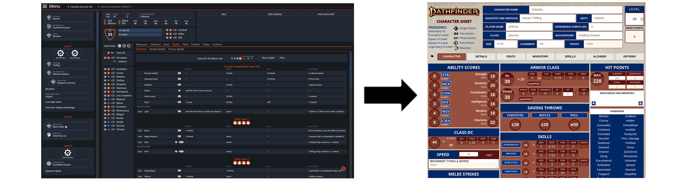
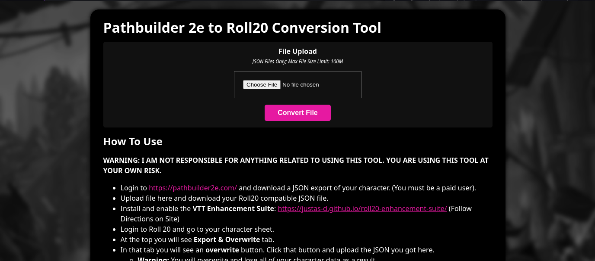

# Pathbuilder 2e to Roll20 Conversion Tool

Takes Pathbuilder 2e JSON files and converts them for use in Roll20 (Imported via VTT Enhancement Suite).

WARNING: I AM NOT RESPONSIBLE FOR ANYTHING RELATED TO USING THIS TOOL. YOU ARE USING THIS TOOL AT YOUR OWN RISK.

## Prerequisites (Web Interface)
You must have the following installed:
- Docker (or Docker Desktop)
- Docker Compose

## Prerequisites (Command Line, Optional)
You must have the following installed:
- PHP 7.0+ (With JSON Encode/Decode Support) (Tested With 7.4)
- Linux/Unix/MacOS Operating System, however CYGWIN w/ PHP should work in windows, though untested.

## Prerequisites (Importing)
- Google Chrome Retail
- VTT Enhancement Suite Plugin: https://justas-d.github.io/roll20-enhancement-suite/

## Starting Docker
- Just run `docker-up.sh` (or `docker-compose up -d` in the root of this folder) and go to `localhost:56709` you should see the following interface:

## Using Command Line Tool
- Download your pathbuilder JSON file from the website: https://pathbuilder2e.com
  - JSON **exports require you to have a paid account**, ask a friend if they have one so they can do it for you.
- Using your terminal, go to the checkout directory and do the following:
  - `php command.php --input=your-pathbuilder-export.json > roll20.json`

## Importing To Roll 20
- Now go to Roll 20 and go to the campaign you'll be using this character with.
- Go to your character sheet (don't pop it out of the window), at the top you'll see [Export & Overwrite], click that.
- Now click [Overwrite] and upload your Roll 20 ready JSON into here.
  - Notes:
    - The VTT import tool is jank, your browser may hang, just close it out completely and re-open it.
    - **If your browser continues to crash on Roll20 disable/remove the VTT after import**
- Go back to your character sheet and everything (mostly) should have been imported.
- You should go up and down a level to force a recalculation of all stats just to be safe.

This application is sorta set up for a web application (minus a few parts), I'm just lazy and I've spent too much work on this already. Might come back to it later.

## Known Limitations
- Even though Max HP is being set it still  needs a level up/down to recalculate.
- Spell Attack and Spell DC are not included.
- Weapons/Armor/Inventory/Gold do not port over on purpose.
- Because Pathbuilder does some non-standard things, some spells might not have any details.
  - **Example**: Fiend's Door (Feat) is listed as a Feat and Innate spell, but it's actually just Dimension Door.
- There are some missing feats descriptions despite the large database.
- No spell attack calculations are done (you must do this yourself if you even use them).

**TL;DR this tool saves you a bunch of input and calculations but you're still gonna have to do some work, espc. if you're a heavy spell caster.**

## Pathfinder 2e SRD Data Disclaimer
I'm not really trying to advertise here, but I have to make note that **I do not own the data for the Pathfinder 2e SRD, this is owned by Paizo.** Please review the OGL here: https://paizo.com/pathfinder/compatibility

I'm using this data purely to insert and update what was missing from pathbuilder's export. Furthermore, **I do not guarantee the integrity of this data.** This was a cobbled effort to get something working. I'm not responsible for any mistakes in the data.
